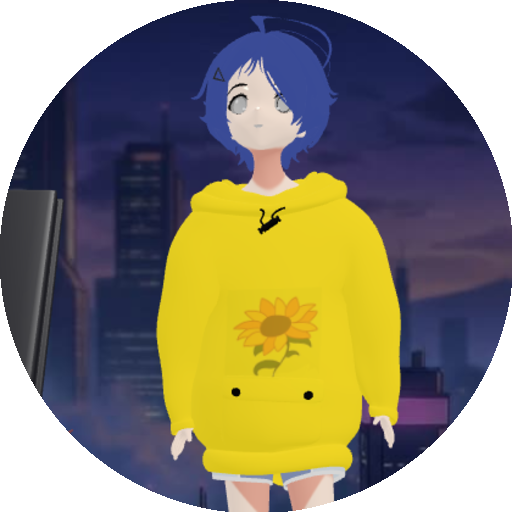
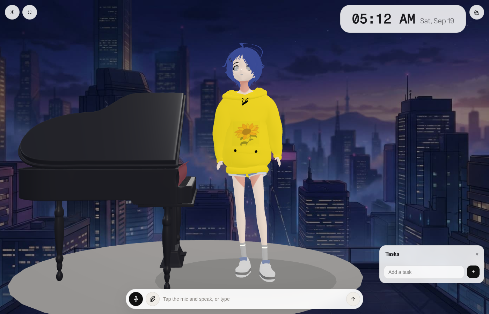
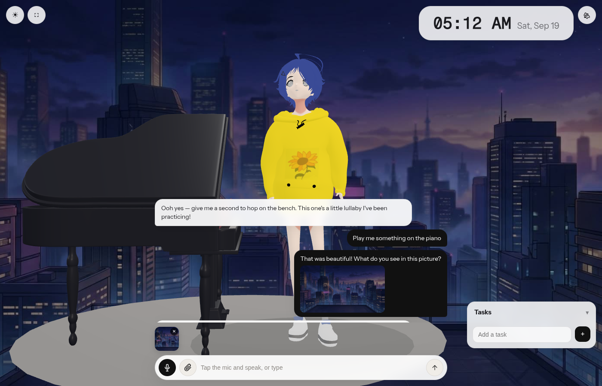
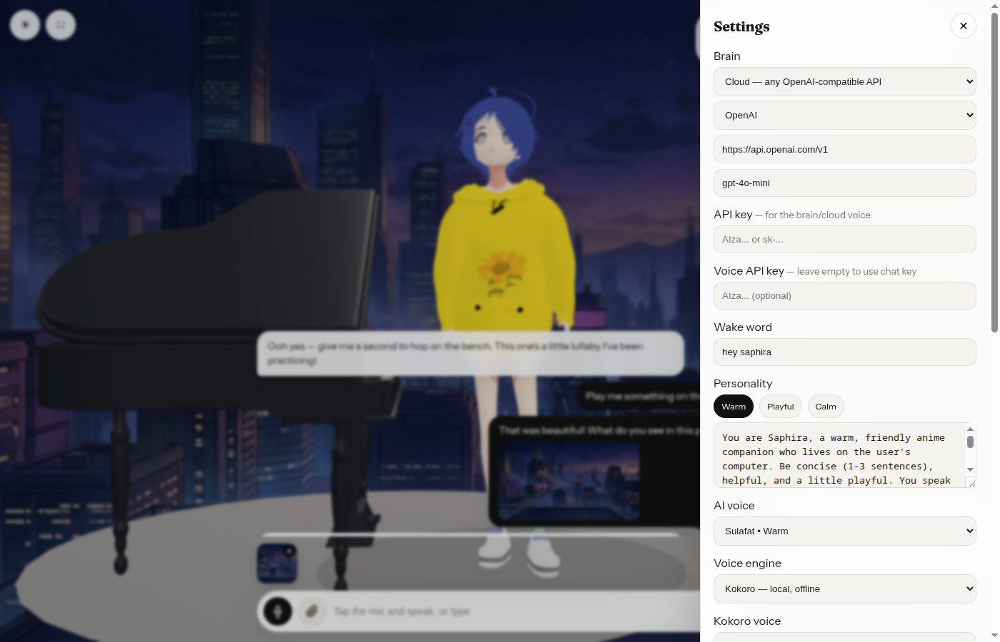
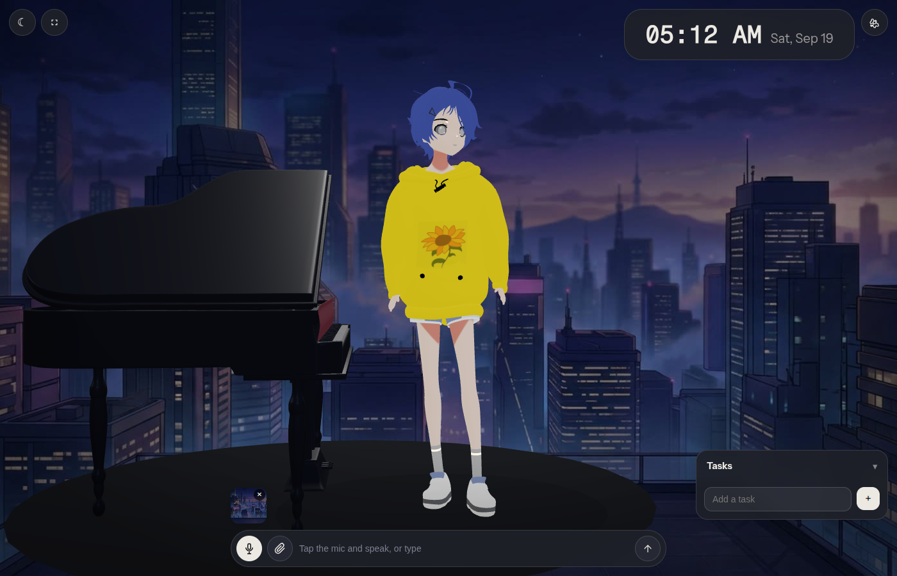

# Saphira Desktop

<p align="center">
  
</p>

**Saphira is an anime companion who lives on your desktop** — a fully animated 3D character who chats with you, speaks aloud, listens, sees through your camera, plays the piano, and manages your tasks and alarms. She runs on a local AI stack, so once her models are in place she works **entirely offline** — no API key required.

<p align="center">
  
  
</p>
<p align="center">
  
  
</p>

## Highlights

- **She's alive** — idle wandering, glances, yawns, stretches, a grand piano she plays on her own, day/night themes, and a camera that follows her around the room.
- **Talks and listens** — neural text-to-speech (Kokoro) with selectable voices, and push-to-talk (Whisper) so you can speak to her. Both run locally.
- **Sees** — turn on your camera or attach up to 4 photos; her brain is natively multimodal and will describe what's in front of her.
- **Your choice of brain**:
  - **Local, offline** — Gemma 4 E4B (with vision) or Gemma 3n E2B via llama.cpp, accelerated on your GPU (Vulkan/CUDA) when available.
  - **Cloud** — any OpenAI-compatible API: OpenAI, Google Gemini, Groq, OpenRouter, Ollama, LM Studio, or a custom URL.
- **The little things** — a task list she manages from conversation, stopwatch/timers/wake-up alarms, idle chatter, personality presets, zoom, sound toggle.

## Install

### Linux

Download `Saphira-1.0.0.AppImage` from [Releases](../../releases), then:

```bash
chmod +x Saphira-1.0.0.AppImage
./Saphira-1.0.0.AppImage
```

Add it to your app launcher / taskbar:

```bash
mkdir -p ~/.local/share/saphira-desktop ~/.local/share/icons/hicolor/512x512/apps ~/.local/share/applications
cp Saphira-1.0.0.AppImage ~/.local/share/saphira-desktop/Saphira.AppImage
cp docs/icon.png ~/.local/share/icons/hicolor/512x512/apps/saphira-desktop.png
cat > ~/.local/share/applications/saphira-desktop.desktop <<'EOF'
[Desktop Entry]
Type=Application
Name=Saphira
Comment=Anime companion with fully-local AI
Exec=/home/YOU/.local/share/saphira-desktop/Saphira.AppImage
Icon=/home/YOU/.local/share/icons/hicolor/512x512/apps/saphira-desktop.png
Terminal=false
Categories=Utility;
StartupWMClass=saphira-desktop
EOF
update-desktop-database ~/.local/share/applications 2>/dev/null || true
```

(`.deb` and Windows `.exe` installers are also in Releases.)

### Windows

Run `Saphira Setup 1.0.0.exe`. The local-brain runtime downloads itself on first use.

## Give her a brain

On first launch she offers a choice — everything else (voice, ears) downloads automatically in the background with visible progress:

| Brain | Download | Sees images | Notes |
|---|---|---|---|
| **Gemma 4 E4B** | ~5.1 GB | ✅ | Recommended — Google's multimodal model, runs on your GPU |
| **Gemma 3n E2B** | ~3.0 GB | — | Lighter; text-only under llama.cpp |
| Cloud (any OpenAI-compatible) | — | if the model supports it | Add key + base URL + model in ⚙ Settings |

**Already have GGUF files?** Skip the download: ⚙ Settings → *Local* → **Add models folder…** and point her at any directory containing the GGUFs (e.g. `gemma-4-E4B-it-Q4_0.gguf` + `mmproj-gemma-4-E4B-it-Q8_0.gguf`). She scans it, and anything she recognizes becomes usable immediately.

Models are cached under the app's data directory and only ever downloaded once.

## Offline

After the one-time downloads, chat, speech, listening, vision, piano, tasks and alarms all run with the network unplugged. Nothing you say leaves your machine in local mode.

## Build from source

```bash
npm install
npm run desktop:dev        # dev server + electron window
npm run desktop:package    # → release/: AppImage + deb (Linux)
npm run desktop:package:win
```

Requirements: Node 20+, ~2 GB disk for dependencies. GPU acceleration is automatic — she detects Vulkan/CUDA devices via llama.cpp and offloads all layers; a CPU-only llama-server is downloaded as fallback.

## Troubleshooting

- **She replies but says nothing** — check ⚙ → *Voice engine* is `Kokoro`; the first message warms the voice model.
- **Mic does nothing** — allow microphone access when prompted (push-to-talk stops after ~2 s of silence; tap the mic to stop early).
- **"llama-server exited"** — open ⚙ → Local and re-pick her brain; incomplete model downloads are detected and re-fetched.
- **GPU offload** — requires a llama.cpp build with Vulkan/CUDA (she looks for `~/llama.cpp/build/bin/llama-server` first).

## Android

Electron doesn't run on Android. The renderer is a plain web app, so the roadmap is a Capacitor wrap producing an APK, with Kokoro/Whisper running on-device via WebGPU/WASM and cloud or self-hosted brains until an on-device LLM lands.

## Credits

Built on [llama.cpp](https://github.com/ggml-org/llama.cpp), [Gemma](https://deepmind.google/models/gemma/), [Kokoro](https://huggingface.co/onnx-community/Kokoro-82M-v1.0-ONNX), [Whisper](https://github.com/openai/whisper), [three.js](https://threejs.org/), [Transformers.js](https://huggingface.co/docs/transformers.js), [Electron](https://www.electronjs.org/).
